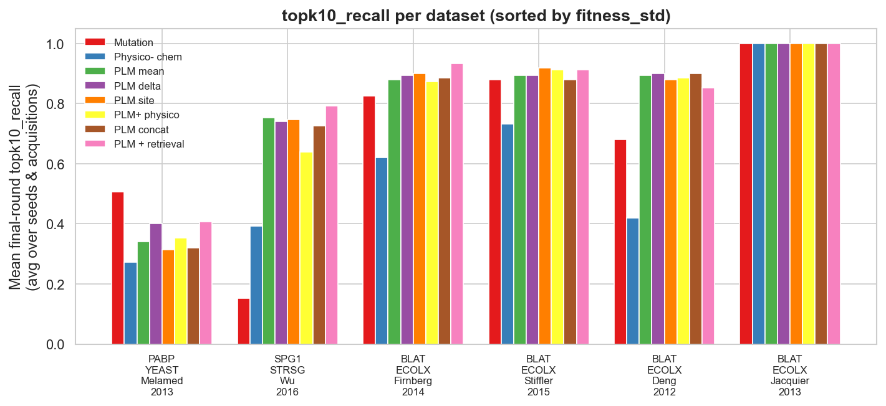
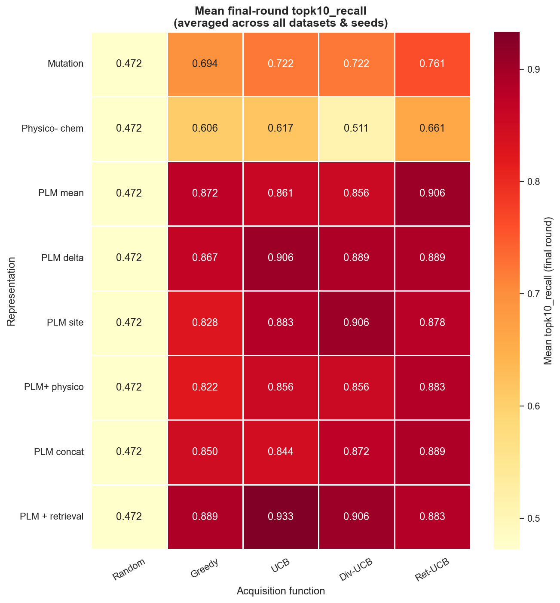

# Sprint 1 Results — Core AL Loop + ESM-2 Representations

**Scope.** Does a protein language model (ESM-2 650M) representation improve
active-learning-guided fitness optimization over hand-crafted features, and which
acquisition function works best? Five representations × five acquisitions ×
three seeds, RF surrogate, on the six original ProteinGym datasets.

## Setup

| Axis | Values |
|---|---|
| Representations | `mutation` (49-d), `physicochemical` (29-d), `plm_mean`, `plm_delta`, `plm_retrieval` (ESM-2 650M, 1280-d) |
| Acquisitions | `random`, `greedy`, `ucb`, `diversity_ucb`, `retrieval_ucb` (β=1.0) |
| Surrogate | Random Forest (100 trees), σ = per-tree std |
| Budget | n_init=50, 20 rounds × batch 128 → ≤ 2,610 labels |
| Seeds | 3 |

**Metrics.** `topk10_recall` = fraction of the true global top-10 variants revealed
by the final round (primary objective); `simple_regret` = global optimum − best
revealed fitness; `pool_spearman` = Spearman ρ between surrogate μ and true fitness
over the hidden pool (surrogate ranking accuracy — a metric-only oracle read).

## Headline: PLM ≫ hand-crafted features; retrieval is the best representation

Final-round `topk10_recall`, averaged over acquisitions & seeds on the four BLAT
datasets + PABP (the datasets where every representation ran):

| Representation | topk10_recall (MEAN) |
|---|---|
| **plm_retrieval** | **0.821** |
| plm_delta | 0.817 |
| plm_mean | 0.801 |
| mutation | 0.779 |
| physicochemical | 0.609 |

All three PLM representations beat both hand-crafted baselines; `plm_retrieval`
(ESM mean-pool + kNN label-context from the labeled set) is the strongest single
representation. Physicochemical composition is the weakest non-random method.

## Per-dataset findings

Final-round `topk10_recall` (mean over acquisitions & seeds):

| Dataset | mutation | physico | plm_mean | plm_delta | plm_retrieval | Note |
|---|---|---|---|---|---|---|
| BLAT_Deng_2012 | 0.68 | 0.42 | 0.89 | 0.90 | 0.85 | **largest PLM gain** |
| BLAT_Firnberg_2014 | 0.83 | 0.62 | 0.88 | 0.89 | **0.93** | see Firnberg note |
| BLAT_Jacquier_2013 | 1.00 | 1.00 | 1.00 | 1.00 | 1.00 | saturates (too easy) |
| BLAT_Stiffler_2015 | 0.88 | 0.73 | 0.89 | 0.89 | 0.91 | |
| PABP_Melamed_2013 | **0.51** | 0.27 | 0.34 | 0.40 | 0.41 | **anomaly — see below** |
| BRCA1_Findlay_2018 | 1.00 | 1.00 | — | — | — | non-PLM only (WT 1863 AA) |

- **BLAT_Deng — largest PLM gain.** Physicochemical 0.42 / mutation 0.68 → PLM
  ~0.85–0.90. PLM representations also reach `simple_regret = 0.047` (vs mutation
  0.177, physico 0.262) — they find the optimum, the baselines don't.
- **PABP — the anomaly.** `mutation` (0.51) beats every PLM representation
  (0.34–0.41) on `topk10_recall`. This is the one landscape where hand-crafted
  features win, and it is the primary motivation for the GP surrogate (see
  `sprint2_results.md`).
- **Firnberg.** `plm_retrieval` is the clear winner (topk10 0.93, mean
  `simple_regret` 0.16 vs mutation 1.04). *This reverses the earlier ESM-2 8M
  prototype finding* of a "deceptive-outlier" pathology (all model-based methods
  stuck at regret 1.1995, never finding the isolated optimum F58N): at 650M the
  higher-capacity embedding + retrieval locate it.
- **Jacquier / BRCA1 saturate** at 1.0 — too easy to discriminate at this budget,
  uninformative for ranking representations.

## Acquisition functions

Final-round `topk10_recall` by acquisition (mean over the PLM representations):

| | random | greedy | ucb | diversity_ucb | retrieval_ucb |
|---|---|---|---|---|---|
| PLM reps | 0.47 | 0.86 | 0.90 | 0.89 | 0.89 |

- **`random` is worst and representation-independent** (identical ~0.47 for every
  representation) — the expected sanity check, since random selection ignores the
  surrogate entirely.
- **`ucb` / `retrieval_ucb` / `diversity_ucb` are the top tier**; the single best
  cell overall is `plm_retrieval × ucb` (0.93).

*(Heatmap and per-dataset bar are over the datasets with a complete grid; the three
Sprint-2 representations shown are analysed in `sprint2_results.md`.)*

### Learning curves (representative)

`topk10_recall` vs AL round — PLM overtakes the baselines within a few rounds on
BLAT_Deng, and the PABP inversion is visible throughout:

- BLAT_Deng: `figures/BLAT_ECOLX_Deng_2012/BLAT_ECOLX_Deng_2012_topk10_recall_by_repr.png`
- PABP: `figures/PABP_YEAST_Melamed_2013/PABP_YEAST_Melamed_2013_topk10_recall_by_repr.png`

## Takeaways

1. **ESM-2 representations substantially improve AL** for fitness optimization over
   hand-crafted features on 4 of the 5 informative datasets.
2. **`plm_retrieval` is the best all-round representation**; retrieval-augmented and
   UCB-style acquisitions win.
3. **PABP is the exception** — hand-crafted `mutation` wins there; the surrogate,
   not the representation, is the suspect (pursued in Sprint 2 via the GP surrogate
   and the `pool_spearman` diagnostic).
