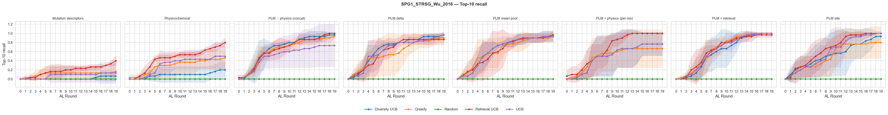
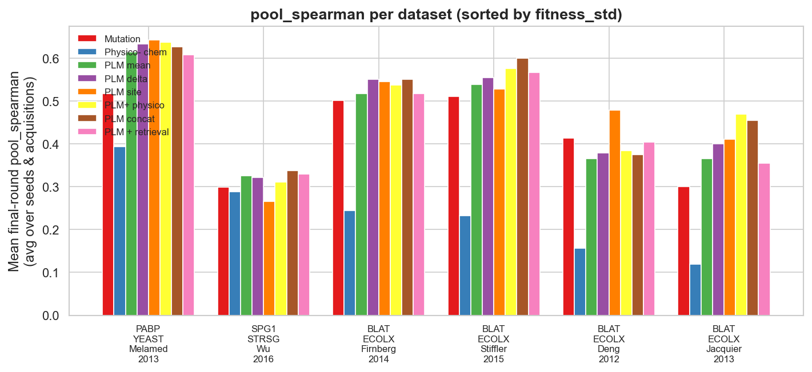

# Sprint 2 Results — New Representations, Multi-site Datasets, Surrogate Diagnostic

**Scope.** Sprint 2 added three PLM representations (`plm_site`, `plm_physico`,
`plm_concat`), two multi-site datasets (GFP, GB1), a surrogate-accuracy metric
(`pool_spearman`), and a GP surrogate. This documents what those additions revealed,
building on `sprint1_results.md` (same RF surrogate, ESM-2 650M, budget, and metrics).

## 1. New representations are competitive, not superior

Final-round `topk10_recall`, averaged over acquisitions & seeds on the **six datasets
with a complete 8-representation grid** (4 BLAT + PABP + GB1):

| Representation | topk10_recall (MEAN) | |
|---|---|---|
| plm_retrieval | 0.817 | Sprint 1 |
| plm_delta | 0.804 | Sprint 1 |
| plm_mean | 0.793 | Sprint 1 |
| **plm_site** | **0.793** | Sprint 2 |
| **plm_concat** | **0.786** | Sprint 2 |
| **plm_physico** | **0.778** | Sprint 2 |
| mutation | 0.674 | |
| physicochemical | 0.573 | |

The three Sprint-2 representations land **mid-pack among the PLM variants** (all six
cluster at 0.78–0.82, within seed noise) — clearly above the hand-crafted baselines,
but they **do not beat the Sprint-1 representations** on equal footing. `plm_retrieval`
remains the strongest single representation.

> **Completeness caveat.** A naive aggregate over *all* eight datasets makes
> `plm_site/physico/concat` appear to lead (~0.80). That is an artifact: those three
> only ran on the six complete datasets and skip **GFP**, whose recall is ~0.2 and
> drags the older reps' means down. On a common set of datasets (above) the effect
> disappears. GFP still lacks the three Sprint-2 reps — its numbers remain provisional.

## 2. Multi-site landscapes — the strongest PLM signal

**GB1 (`SPG1_STRSG_Wu_2016`, 4-site combinatorial, ~149K variants)** is the sharpest
PLM win in the entire benchmark. Final-round `topk10_recall` (mean over acqs & seeds):

| mutation | physico | plm_physico | plm_concat | plm_delta | plm_site | plm_mean | plm_retrieval |
|---|---|---|---|---|---|---|---|
| **0.153** | 0.393 | 0.640 | 0.727 | 0.740 | 0.747 | 0.753 | **0.793** |

- **Hand-crafted `mutation` collapses to 0.153** — mutation-string features cannot
  capture 4-site epistasis — while PLM embeddings reach 0.64–0.79.
- Every PLM representation reaches `simple_regret = 0.000` with greedy/ucb/diversity
  (i.e. **finds the global optimum**); mutation stays stuck at 1.15–1.92.
- Best cell: `plm_site × ucb = 1.000` (perfect top-10 recall).

**Takeaway: the PLM advantage grows with landscape complexity** — smallest on
single-mutant ordinal sets, largest on multi-site combinatorial GB1.

*(GFP (`GFP_AEQVI`, ~51K, multi-site) is only partially run — 5 of 8 reps. Provisional:
PLM ~0.21 vs mutation/physico ~0.09, so PLM ~2× better, but absolute recall is low on
this hard landscape. A full-grid re-run is pending before drawing firm GFP conclusions.)*

## 3. `pool_spearman` — locating the PABP anomaly

`pool_spearman` (Spearman ρ between surrogate μ and true fitness over the hidden pool)
measures how well the surrogate *ranks* the pool, complementing `topk10_recall` (which
measures whether the *top* is found). On PABP the two metrics disagree:

| PABP | mutation | plm_mean | plm_delta | plm_site | plm_physico | plm_retrieval |
|---|---|---|---|---|---|---|
| pool_spearman | 0.517 | 0.615 | 0.633 | 0.643 | 0.638 | 0.608 |
| topk10_recall | **0.507** | 0.340 | 0.400 | 0.313 | 0.353 | 0.407 |

**With PLM features the surrogate ranks the bulk of the pool *better* (higher ρ) yet
recalls the true top-10 *worse*.** The PABP failure is therefore **localized to the top
of the landscape**, not a global ranking problem. (Consistent nuance: on raw
`best_fitness`, `plm_site × ucb` reaches 2.869 on PABP — PLM *can* find one great
variant; it just cannot recall the top *set*.) This is the precise, quantified
motivation for a better-calibrated surrogate.

A second, cross-dataset pattern: **`random` acquisition yields the highest
`pool_spearman` but the lowest `topk10_recall`** for every representation (e.g.
plm_site: random ρ 0.73 vs greedy 0.43). Unbiased sampling → best global rank
correlation but worst top-k discovery — a clean exploration/exploitation signature,
and confirmation that **`topk_recall`, not `pool_spearman`, is the right primary
objective** for "find the best variant."

## 4. GP surrogate — status

`GPSurrogate` (single-task ExactGP, `ConstantMean + ScaleKernel(Matérn 3/2)`, per-round
warm-start, latent-posterior σ for pure epistemic uncertainty) is implemented and
CLI-wired (`--surrogate gp`), with results written to `_gp`-suffixed paths so they never
overwrite the RF baseline. The targeted GP grid — PABP + BLAT_Deng × {mutation, plm_mean,
plm_physico} × {greedy, ucb} × 3 seeds = **36 cells** — is the case study for the
question this sprint raised: *does better uncertainty calibration fix the PABP
top-of-landscape failure?* GP-vs-RF analysis is pending the run (deployment hardened for
per-cell memory isolation; see `agent_log.md`).

## Takeaways

1. The Sprint-2 PLM representations are **solid but not a step change** over Sprint 1;
   `plm_retrieval` stays the best all-round representation.
2. **Multi-site complexity is where PLM matters most** (GB1: mutation 0.15 → PLM 0.79).
3. `pool_spearman` **pinpoints the PABP anomaly** as a top-of-landscape calibration
   failure of the RF surrogate — a targeted, testable hypothesis for the GP.
